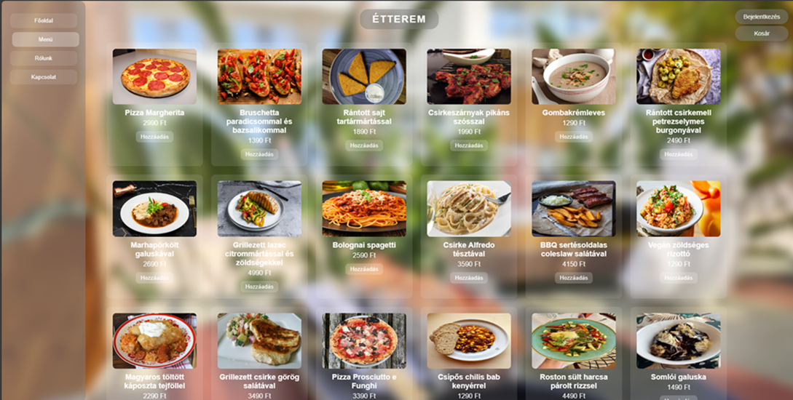

# 🌐 SFM 2025 – University Project  

This is a web application powered by **Spring Boot & Maven**, **SQLite3**, and **HTML/JavaScript**.  
The project is developed for the **SFM 2025 university lecture**. 🎓  

---

## 📅 Development Period  
2025.09 – 2025.11 (YYMM format)

  

---

## 🚀 Getting Started  

1. **Download and install IntelliJ IDEA Community Edition**  
   👉 [Download here](https://www.jetbrains.com/idea/download/download-thanks.html?platform=windows&code=IIC)  

2. **Install the latest Java SDK**  
   👉 [Java SDK download](https://www.oracle.com/java/technologies/downloads/)  

3. **Project setup**  
   - Add the `sfm2025` folder to your IntelliJ project  
   - Configure the latest Java SDK in IntelliJ  
   - Run the project  

4. **After running, open in your browser:**  
   👉 [http://localhost:8080](http://localhost:8080)  

---

## 📦 Project Features  

- 👤 User profiles & authentication  
- 🔒 Encrypted password storage  
- 📝 Dynamic content management  
- 🎨 Easy-to-use design  
- ⚙️ Fast & simple setup  

---

## 📖 Notes  

This is under development. No release yet. 
